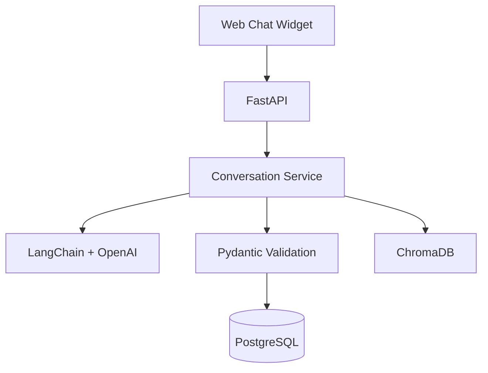

# Event Creation Chatbot

An AI-assisted chatbot that guides users through creating events via natural conversation, validates their input with Pydantic, persists to PostgreSQL, and stores conversation embeddings in ChromaDB.

---

## Architecture Overview




---

## Quick Start

### Option A — Docker Compose (recommended)

```bash
# 1. Clone and enter the directory
git clone <repo> event-chatbot && cd event-chatbot

# 2. Configure environment
cp .env.example .env
# Edit .env — set your GEMINI_API_KEY 

# 3. Start everything (Postgres + App)
docker-compose up --build

# 4. Open the chat UI
open http://localhost:8000
```

### Option B — Local (virtualenv)

**Prerequisites:** Python 3.10+, PostgreSQL 14+

```bash
# 1. Install dependencies
python -m venv venv
source venv/bin/activate   # Windows: venv\Scripts\activate
pip install -r requirements.txt

# 2. Configure environment
cp .env.example .env
# Edit .env with your DB credentials and GEMINI_API_KEY

# 3. Create the database
createdb event_chatbot
psql -U postgres -d event_chatbot -f sql/schema.sql

# 4. Run the server
uvicorn app.main:app --reload --port 8000

# 5. Open the chat UI
open http://localhost:8000
```

---

## Environment Variables


| Variable             | Default            | Description           |
| -------------------- | ------------------ | --------------------- |
| `GEMINI_API_KEY`     | *(required)*       | Google Gemini API key |
| `GEMINI_MODEL`       | `gemini-1.5-flash` | Gemini model name     |
| `DB_HOST`            | `localhost`        | PostgreSQL host       |
| `DB_PORT`            | `5432`             | PostgreSQL port       |
| `DB_NAME`            | `event_chatbot`    | Database name         |
| `DB_USER`            | `postgres`         | DB user               |
| `DB_PASSWORD`        | `postgres`         | DB password           |
| `CHROMA_PERSIST_DIR` | `./chroma_data`    | ChromaDB storage path |
| `APP_PORT`           | `8000`             | Uvicorn listen port   |


---

## API Endpoints


| Method   | Path                  | Description                              |
| -------- | --------------------- | ---------------------------------------- |
| `POST`   | `/api/chat`           | Send a chat message, receive AI response |
| `POST`   | `/api/register-event` | Directly register a validated event      |
| `GET`    | `/api/events`         | List all saved events                    |
| `GET`    | `/api/events/{id}`    | Get one event by ID                      |
| `DELETE` | `/api/sessions/{id}`  | Reset a chat session                     |
| `GET`    | `/health`             | Health check                             |


Full request/response schemas are auto-generated at **[http://localhost:8000/docs](http://localhost:8000/docs)** (Swagger UI) when the server is running.

---

## Chatbot Response Scenarios


| Scenario                | When triggered                                                       |
| ----------------------- | -------------------------------------------------------------------- |
| `missing_field`         | A required field has not yet been provided                           |
| `invalid_input`         | Provided value fails validation (bad email, wrong date format, etc.) |
| `confirmation`          | All fields collected; chatbot summarises and asks to save            |
| `success_save`          | Event successfully saved to the database                             |
| `error_db`              | Database error or duplicate event                                    |
| `update_previous_field` | User revises a previously-given answer                               |


---

## Running Tests

```bash
# All tests (no real DB or OpenAI required — everything is mocked)
pytest

# Specific test files
pytest tests/test_validation.py -v
pytest tests/test_conversation.py -v
pytest tests/test_api.py -v
pytest tests/test_database.py -v

# With coverage
pip install pytest-cov
pytest --cov=app --cov-report=term-missing
```

---

## Example Conversation Flow

```
User:  I want to create an event.
AI  :  {"role":"assistant","scenario":"missing_field",
        "message":"Great! What is the name of your event?"}

User:  Kyoto Jazz Night
AI  :  {"role":"assistant","scenario":"missing_field",
        "message":"Got it — updated Name: Kyoto Jazz Night.
                   What is the event date? (YYYY-MM-DD)"}

User:  March 10th 2026
AI  :  {"role":"assistant","scenario":"missing_field",
        "message":"Got it — updated Date: 2026-03-10.
                   What time does it start? (HH:MM in 24-hour format)"}

…  (further turns collect time, seat types, ticket limit, purchase period,
    venue, capacity, organizer, email, category)

AI  :  {"role":"assistant","scenario":"confirmation",
        "message":"Great, I have all the details! [summary] Shall I save?"}

User:  Yes
AI  :  {"role":"assistant","scenario":"success_save",
        "message":"Event 'Kyoto Jazz Night' saved successfully to the database!"}
```

**Error-recovery example** — invalid email triggers `invalid_input`:

```
User:  contact@techsummit.invalid
AI  :  {"role":"assistant","scenario":"invalid_input",
        "message":"'contact@techsummit.invalid' is not a valid email address.
                   Could you correct it?"}

User:  Sorry, contact@techsummit.jp
AI  :  {"role":"assistant","scenario":"missing_field",
        "message":"Got it — updated Organizer Email: contact@techsummit.jp.
                   What category does this event fall under?"}
```

**Revision after confirmation** — user changes a previously-given answer:

```
User:  Actually, change the date to May 22nd.
AI  :  {"role":"assistant","scenario":"update_previous_field",
        "message":"Got it — updated Date: 2026-05-22.
                   Anything else to update, or shall I re-summarize?"}
```

See [`CONVERSATION_LOGS.md`](./CONVERSATION_LOGS.md) for full turn-by-turn transcripts.

---

